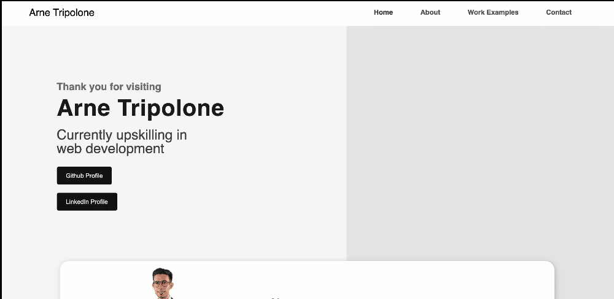

# Portfolio Homework

## Link to Deployed Site: https://arnetripolone.github.io/portfolio-homework/

### Description:
This repository contains Arne Tripolone’s portfolio website. This is created with HTML and CSS covered in the Bootcamp so far. 
Much of the design was sourced from You-Tube Chanel ‘Going-To Internet’, specifically the video tutorial: ‘How To Create A Complete Personal Portfolio Website Just using HTML And CSS | Pure HTML And CS’ (https://www.youtube.com/watch?v=KgRENOnSCxE). 
This was one of the few sources I found which provided a template that didn’t involve JSS or other tech not yet covered in the Coding Bootcamp. 
Other elements came from w3schools, such as the contact form - https://www.w3schools.com/howto/howto_css_contact_form.asp . 

Most of the acceptance criteria for this task has been fulfilled, except for making initial application images appearing larger which I was unable to figure out. 
One of the biggest challenges with creating this website was image sizing and their backgrounds. 
I was hoping to attach an image without a background, but this didn’t seem to be possible for me. 
Another challenge was accepting the size of the css file which seems to be bigger than Ben Hur, although it wasn’t possible for me to reduce it. The Google Inspector was very useful for this task, to see what elements were being affected by css.

### Screenshots
#### HTML:

