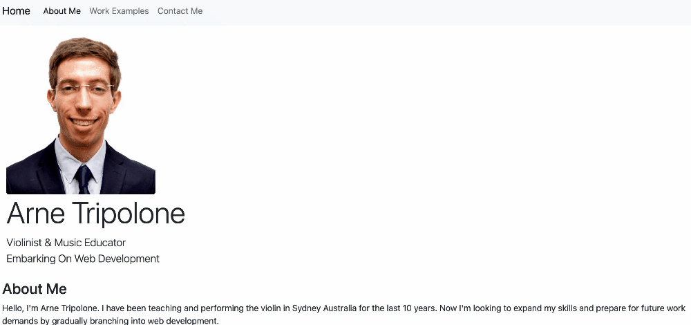

# Portfolio

## Link to Deployed Site: https://arnetripolone.github.io/portfolio 

### Description
Originally this repository featured my portfolio website created purely with  HTML and CSS. After feedback + trial and error, I decided it would be best to undergo a complete overhaul and implement a CSS framework - Bootstrap. This greatly enhanced the responsiveness of the site, allowed for striking visuals (for instance the work example carousel) and elegant button configuration in the contact page. Bootstrap also necessitated far less code than HTML and CSS alone, offering a tidier representation of my work which I am happy to link on my various social media accounts.

### Gif of Deployed Site

